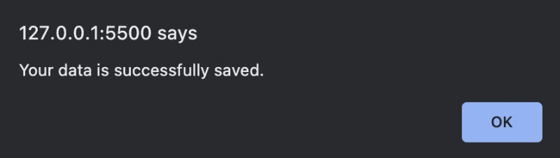

# **W5-challenge-scheduler-calendar-app**

In week 5 challenge, we're assigned to fix HTML and JavaScript codes to make the scheduler-calendar web application functional. This challenge is a great tutorial in these particular topics:
- dayjs() and formatting
- DOM traveral and selections
- loop
- conditional statements
- JavaScript string and array methods
- localStorage
- management of codes

## **URLs**
- [Deployed Application URL](https://jouriena11.github.io/W5-challenge-scheduler-calendar-app/)
- [GitHub Repository URL](https://github.com/jouriena11/W5-challenge-scheduler-calendar-app)

## **Expected Behavior**

1. The starting web app should look like this:

    

    
    

    - Current data and time should appear in the header section
    - Past time block should have gray background
    - Current time block should have red background
    - Future time block should have green background
    - Available time blocks range from 9AM to 17PM

2. If a user attempts to save empty textarea, the following alert message would appear:

    

    
    

3. If data is saved successfully, the following alert message would appear:

    

    
    

4. Saved data is stored to localStorage

    

    
    

5. Saved data on localStorage is automatically dispalyed upon page refresh

    

    
    

## **Approaches to Solving the Challenge**

### **Functions Grouping**

Aside from displaying current time in the header tag, which is achieved simply by using dayjs().format and is independently executed, there are 4 other main functions in this web application:

1. Rendering data -- timeBlockRender() function
    - automatically changing CSS class at a given time
    - displaying time in a 0-12 AM/PM format
    - automatically creating time blocks with different ID for each hourly row
    - displaying saved data on page refresh

2. Saving data to localStorage -- saveItem() function
    - invoking alert message when a user attempts to save an empty textarea
    - checking if there's existing saved data on localStorage
        - If yes, then replace the existing data with new data
        - If no, then save the data

3. Applying addEventListener to each save button -- addEventListenerSaveButton() function
    - clicking the save button would invoke the saveItem() function

4. Initialize the data and codes -- init() function
    - getting data from localStorage
    - invoking timeBlockRender() and addEventListener() functions

### **Using a combination of var, let, and const**

From this point onward, I intend to start using let and const in addition to var. As the codes get longer, it is easy for codes to accidentally malfunction with just var alone. Knowing that there are certain variables that will never be redeclared and reassigned, e.g. the current date and time and HTML element with specific ID, using const instead of var is deemed appropriate. And as let is limited to a block scope, whereas var is not (other than a function), using let gives more control and less vulnerable to mistakes.

### **Rows of textarea / scheduled items input**

Although starter codes are provided in the HTML, I understand that they only serve simply as examples of rendered results (i.e., past = gray, preset = red, and future = green), and that it's not mandatory to maintain them in the HTML files. After all, hardcoding the rest of the hourly rows in the HTML file would result in unnecessary lengthy codes, especially when this can be automatically generated with JavaScript loop. In reference to Week 5 Student Activity # 10, it's also possible to assign a variable with the whole 
 element as value. Hence, this is deemed a much more efficient way to create scheduled item elements. These codes are put together inside the timeBlockRender() function.

### **Deciding when to code with JavaScript and jQuery**

I've been told that JavaScript codes are processed at a much faster speed comparing to jQuery codes, regardless of actual human perception (i.e., the difference in speed might not be clearly noticeable to human users in real life), whereas jQuery make it much easier to write codes. But a good web developer should know how to code in both JavaScript and jQuery (as well as any other programming languages that are currently in demand), so I coded this assignment with a mixture of JavaScript and jQuery for practicing purpose.

## **Extended Personal Study**

- insertAdjacentHTML() (https://css-tricks.com/comparing-methods-for-appending-and-inserting-with-javascript/)
- findIndex() (https://www.w3schools.com/jsref/jsref_findindex.asp)

## **Application Limitation and further improvement**

One notable issue with this web application is that a user might want to delete an entry at some point and that wouldn't be possible if the user wants to save an empty textarea. It's possible, of course, to allow saving an empty textarea to localStorage, but saving an empty string wouldn't be very useful. A better solution to this is probably to add another 'x' button after the save button for removing the data, hence a potential area for improvement.
